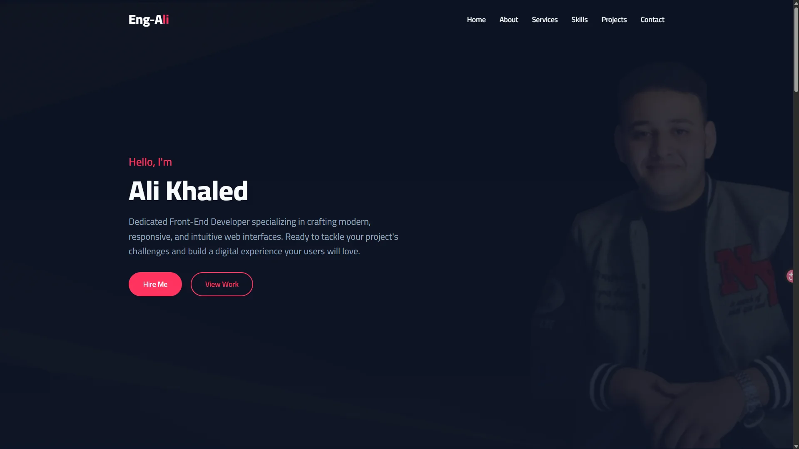

<div align="center">

# Ali Khaled | Personal Portfolio


A modern, highly interactive, and fully responsive personal portfolio built to showcase my skills, services, and dynamic projects.

[](https://engali983.github.io/ali-khaled-portfolio/)



</div>

<br />

## 🌟 Key Features

✅ **Dynamic GitHub Integration**: Automatically fetches and filters the latest repositories using the GitHub API.<br>
✅ **Typing Animation**: Infinite dynamic typing effect in the hero section for a premium feel.<br>
✅ **Project Filtering**: Smart tag-based filtering system (React, JavaScript, API, CSS) for easy project discovery.<br>
✅ **Interactive UI Elements**: Custom scroll progress bar and a "Back to top" action button.<br>
✅ **Fully Working Contact Form**: Integrated with **EmailJS** to send emails directly without a backend.<br>
✅ **Performance Optimized**: Uses modern `Intersection Observer` for efficient, buttery-smooth scroll fade-in animations.<br>
✅ **100% Responsive Design**: Carefully crafted layouts that look perfect on mobile phones, tablets, and massive desktop monitors.

---

## 🛠️ Tech Stack

| Technology | Purpose |
| ---------- | ------- |
| **React 18** | Core UI library for building modular, reusable components. |
| **Vite** | Blazing fast build tool and development server. |
| **Tailwind CSS v3** | Utility-first CSS framework for rapid and consistent styling. |
| **EmailJS** | Client-side email service for the contact form. |
| **GitHub REST API** | Fetching live repository data and topics dynamically. |

---

## 🚀 Getting Started

Follow these steps to run the project locally on your machine.

### Prerequisites
Make sure you have [Node.js](https://nodejs.org/) installed on your machine.

### Installation

1. **Clone the repository:**
   ```bash
   git clone https://github.com/engAli983/ali-khaled-portfolio.git
   ```

2. **Navigate to the project directory:**
   ```bash
   cd ali-khaled-portfolio
   ```

3. **Install dependencies:**
   ```bash
   npm install
   ```

4. **Start the development server:**
   ```bash
   npm run dev
   ```

5. **Open your browser:**  
   Navigate to `http://localhost:5173` to view the website locally.

---

## 📫 Contact & Links

Feel free to reach out for collaborations or freelance opportunities!

- **GitHub:** [engAli983](https://github.com/engAli983)
- **LinkedIn:** [Ali Khaled](https://www.linkedin.com/in/ali-khaled-014b21344/)

---

## 📄 License

This project is licensed under the MIT License - see the [LICENSE](LICENSE) file for details.
